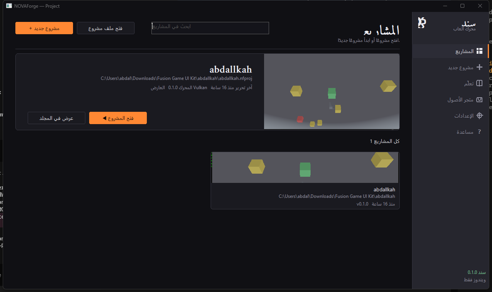
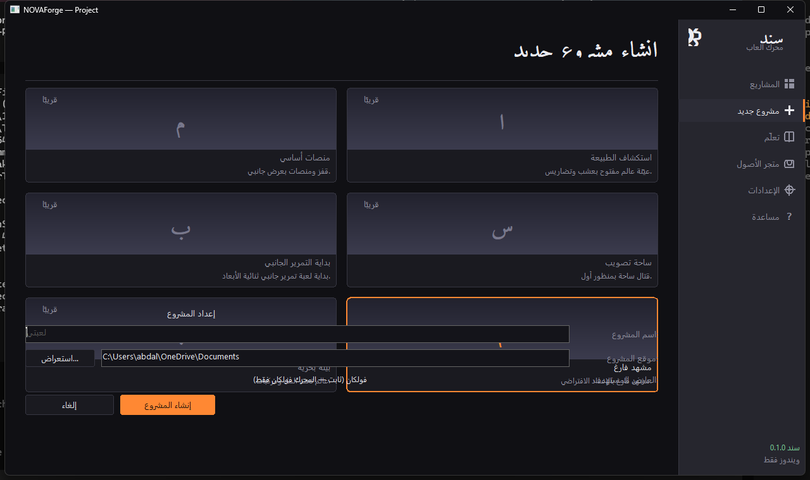
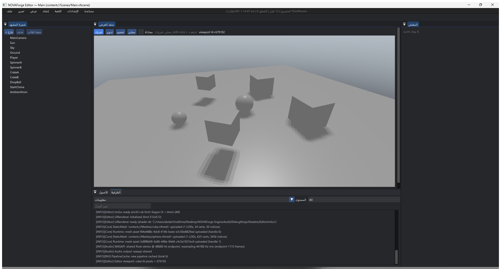
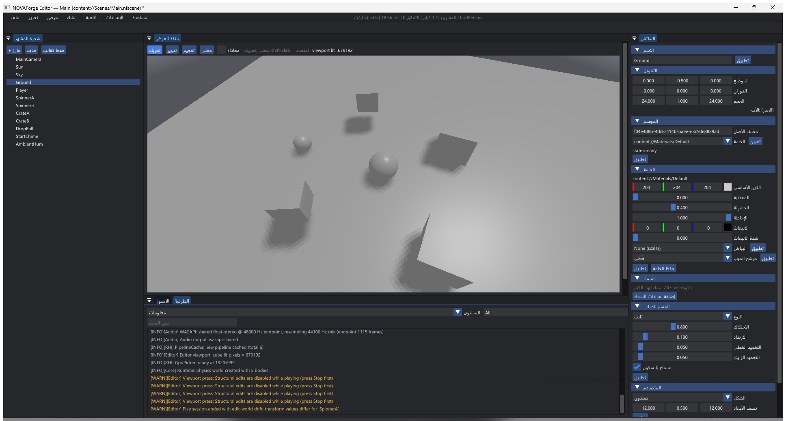
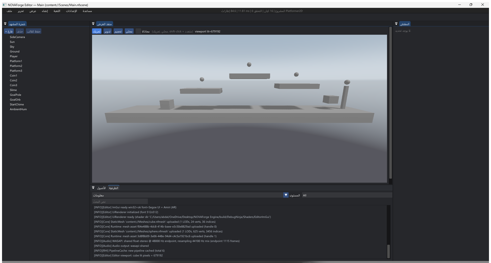

# من الصفر إلى لعبة مبنية — دليل سند في 20 دقيقة

> دليل عملي لمحرك **سند / NOVAForge**. مكتوب لمن **لم يفتح محرك ألعاب من قبل**، ولا يكتب
> كودًا. ستُنهي هذا الدليل ولديك مشروع لعبة يعمل، ومجلد جاهز للمشاركة.
>
> **الزمن المتوقّع:** 20 دقيقة للقراءة والتنفيذ معًا. **النظام:** ويندوز 64-بت فقط.

---

## ما ستحتاجه

| المتطلب | التفصيل |
|---|---|
| نظام التشغيل | ويندوز 10 أو 11، إصدار 64-بت |
| كرت الرسوميات | أي كرت يدعم **Vulkan** (معرّفات Intel/AMD/NVIDIA الحديثة تكفي) |
| مساحة القرص | نحو 1 غيغابايت للمحرك ومشروعك |
| المحرر | `NOVAForgeEditor.exe` — ولا يحتاج تثبيتًا |

كل ما في هذا الدليل يعمل من مجلد المحرك مباشرة. لا تثبيت، ولا متغيّرات بيئة، ولا
سطر أوامر إلزامي (سطر الأوامر يظهر في الخطوة 6 فقط، وسنشرحه كلمة بكلمة).

---

## الخطوة 1 — شغّل المحرر (دقيقتان)

افتح مجلد المحرك، ثم:

```
build\DebugNinja\bin\NOVAForgeEditor.exe
```

انقر عليه نقرًا مزدوجًا. ستظهر **نافذة المشغّل (Launcher)** — وهي ليست المحرر نفسه،
بل بوابة الدخول: منها تُنشئ مشروعًا أو تفتح مشروعًا قديمًا.



**ما تراه على الشاشة:**

- **الشريط الجانبي** على اليمين: `المشاريع` · `مشروع جديد` · `تعلّم` · `متجر الأصول` ·
  `الإعدادات` · `مساعدة`.
- **`+ مشروع جديد`**: الزر البرتقالي أعلى اليسار — منه تبدأ أي لعبة جديدة.
- **`فتح ملف مشروع`**: لفتح مشروع موجود بصيغة `.nfproj`.
- **`ابحث في المشاريع`**: للبحث في قائمة مشاريعك الأخيرة.
- **`كل المشاريع`**: بطاقات المشاريع التي فتحتها سابقًا.

> **لتحويل الواجهة إلى العربية:** `الإعدادات` ← `التفضيلات العامة` ← اختر
> **العربية (Arabic)**. تتحوّل الواجهة فورًا دون إعادة تشغيل، ويبقى اختيارك محفوظًا في
> المرات القادمة.

---

## الخطوة 2 — أنشئ مشروعك الأول (3 دقائق)

اضغط **`+ مشروع جديد`** (أو `مشروع جديد` من الشريط الجانبي). تظهر صفحة الإنشاء:



**رتّب الأمور بهذا الترتيب:**

1. **اختر القالب** من المعرض في الأعلى. القوالب المتاحة للإنشاء اليوم:
   - **`مشهد فارغ`** (Blank Scene) — مشهد ثلاثي الأبعاد جاهز: كاميرا، شمس، أرضية،
     مجسّم مكعّب، صندوق يسقط بالفيزياء، ومجسّم يدور مع نغمة صوتية. رغم اسمه ليس فارغًا:
     فيه كل ما تحتاجه لترى المحرّك يعمل من الثانية الأولى. هذا هو القالب الذي سنستخدمه
     في هذا الدليل.
   - البطاقات الأخرى (`منصات أساسي` · `ساحة تصويب` · `بداية التمرير الجانبي` ·
     `استكشاف الطبيعة` · `بيئة بحرية`) تظهر بعلامة **`قريبًا`** — الشكل النهائي للمعرض
     موجود، والمحتوى يُضاف تدريجيًا. راجع قسم **«قوالب الألعاب الجاهزة»** في آخر هذا
     الدليل لمعرفة ما هو متاح فعليًا اليوم.
2. **`اسم المشروع`**: اكتب اسمًا لاتينيًا بسيطًا بلا مسافات — مثلًا `MyFirstGame`.
   المحرّر يرفض الأسماء التي تحتوي مسارًا (`/` أو `\` أو `:`).
3. **`موقع المشروع`**: المجلد الذي سيُوضع فيه المشروع. الافتراضي هو `Documents`.
   اضغط **`استعراض…`** لتغيير الموقع.
4. **`العارض المستهدف`**: يبقى **Vulkan** — المحرّك لا يدعم غيره، وهذا مقصود.
5. اضغط **`إنشاء المشروع`**.

سيبني المشغّل مجلد المشروع، وينسخ إليه محتوى القالب، ثم **يفتح المحرّر على مشروعك
مباشرة**. إنشاء المجلد ونسخ المحتوى لحظيان؛ والثواني القليلة الباقية هي زمن فتح
المحرّر نفسه.

**ما الذي أُنشئ على القرص؟**

```
MyFirstGame\
  MyFirstGame.nfproj     ← وصف المشروع (اسمه، ومشهد البداية، ونقاط التركيب)
  Content\
    Scenes\Main.nfscene  ← مشهدك: هذا هو الملف الذي تعدّله
    Meshes\cube.nfmesh   ← المجسّمات
    Materials\Default.nfmat
    AssetRegistry.nfreg  ← سجلّ الأصول: يربط كل مجسّم بمعرّفه
  Cache\                 ← أصول مُعالَجة (يولّدها البناء)
  Shaders\               ← الشيدرز المترجمة
  dist\                  ← لعبتك النهائية تُبنى هنا
  .gitignore
```

---

## الخطوة 3 — تعرّف على المحرّر (3 دقائق)

تفتح نافذة المحرّر على مشهدك مباشرة:



**خمس مناطق، لا أكثر:**

| المنطقة | الموقع | وظيفتها |
|---|---|---|
| **شجرة المشهد** (Outliner) | أعلى اليسار | قائمة كل ما في المشهد: الكاميرا، الشمس، الأرضية، المجسّمات… انقر أي سطر لتحديده |
| **منفذ العرض** (Viewport) | الوسط | ما ستراه اللاعب. هنا تُحرّك وتُدير وتُقرّب |
| **المفتش** (Inspector) | يمين | خصائص الشيء المحدَّد: موضعه، دورانه، حجمه، خامته |
| **الأصول** (Assets) | أسفل اليسار | ملفات مشروعك: المشاهد، المجسّمات، الخامات |
| **الطرفية** (Console) | أسفل الوسط | رسائل المحرّك والأخطاء — أول ما تنظر إليه إذا حدث شيء غريب |

**التحرّك داخل منفذ العرض:**

- **زر الفأرة الأيمن + السحب** — دوران النظر حول المشهد.
- **زر الفأرة الأيمن + مفاتيح `W` `A` `S` `D`** — تنقّل للأمام والخلف والجانبين.
- **زر الفأرة الأيمن + `Q` / `E`** — هبوط وصعود.
- **عجلة الفأرة** — تقريب وتبعيد.
- **زر الفأرة الأيسر** — تحديد المجسّمات، وتشغيل أدوات التحريك (Gizmo).

**شريط القوائم في الأعلى** (من اليسار إلى اليمين بالعربية): `ملف` · `تحرير` · `عرض` ·
`إنشاء` · `اللعبة` · `الإعدادات` · `مساعدة`. أزرار سريعة تقع في الطرف الأيمن من شريط
الأدوات: **`تشغيل`** و**`حفظ`**.

---

## الخطوة 4 — شغّل لعبتك (دقيقتان)

هذه أهم خطوة في الدليل: **لا تبنِ شيئًا لتجرّب.** المحرّر يشغّل مشهدك داخله.

اضغط زر **`تشغيل`** في أقصى يمين شريط الأدوات، أو من القائمة: **`اللعبة` ← `تشغيل`**.



**ما يتغيّر:**

- عنوان النافذة تُضاف إليه علامة `*` — أي أن اللعبة تعمل الآن.
- تبدأ الأنظمة الحقيقية بالعمل: **الفيزياء** (تسقط الأجسام وتستقرّ)، و**الحركة**
  (تدور المجسّمات)، و**الصوت** (تُشغَّل النغمات).
- في الطرفية تقرأ سطرًا مثل:
  `Play session entered (edit snapshot stored, 5 bodies)` — أي أن المحرّك أخذ «صورة»
  من مشهدك قبل التشغيل ليستطيع إرجاعه كما كان.

**قاعدة يجب أن تعرفها:** أثناء التشغيل **لا يُسمح بتعديلات البنية** (إضافة أو حذف
كيانات). إذا حاولت، تكتب الطرفية:
`Structural edits are disabled while playing (press Stop first)` — وهي رسالة واضحة لا خطأ.

اضغط **`إيقاف`** (أو `اللعبة` ← `إيقاف`) للعودة إلى وضع التحرير. عند الإيقاف يعيد
المحرّك مشهدك إلى ما كان عليه بالضبط قبل التشغيل.

> **ماذا يعني هذا؟** يمكنك الآن تعديل رقم في المفتش، تضغط `تشغيل`، ترى النتيجة، تضغط
> `إيقاف` — في ثانيتين. هذه هي دورة العمل الأساسية في صناعة الألعاب.

---

## الخطوة 5 — عدّل مشهدك (5 دقائق)

لنغيّر شيئًا ملموسًا: **لنجعل المكعّب يسقط من ارتفاع أكبر**.

مشهد «مشهد فارغ» لا يسمّي كياناته، لذا تظهر في شجرة المشهد بأسماء عامة:
`Entity 1` … `Entity 6`. أوّل خطوة — وهي عادة جيّدة — أن تسمّي ما تعمل عليه:

1. من **شجرة المشهد** (أعلى اليسار) انقر السطر **`Entity 5`**. هذا هو المكعّب الحقيقي:
   له جسم صلب متحرّك ومتصادم صندوقي، ولهذا يسقط ويتوقّف على الأرضية. سيُحدَّد في منفذ
   العرض ويظهر إطاره.
2. في **المفتش** على اليمين، في أعلى اللوحة، قسم **`الاسم`**. اكتب فيه `Cube` ثم اضغط
   زر **`تطبيق`** بجانبه. يتغيّر الاسم في شجرة المشهد فورًا.
3. انزل إلى قسم **`التحويل`**. فيه ثلاثة حقول:
   - **`الموضع`** (Position) — أين يقع المجسّم: ثلاثة أرقام `X` `Y` `Z`.
   - **`الدوران`** (Rotation) — بزوايا بالأدرجة.
   - **`الحجم`** (Scale) — التكبير/التصغير.
4. قيمة **`Y`** في `الموضع` هي `5` الآن (أي خمسة أمتار فوق الأرض). غيّرها إلى `9`.
5. اضغط **`تشغيل`**. سيسقط المكعّب من ارتفاع أكبر ويستقرّ على الأرضية. اضغط `إيقاف`.
6. **أخطأت؟** `تحرير` ← `تراجع` أو **`Ctrl+Z`**. و`Ctrl+Y` للإعادة.
7. **احفظ:** `ملف` ← `حفظ المشهد` أو **`Ctrl+S`**.

**ثلاث تجارب أخرى تستحقّ دقيقتين:**

- **أضف ضوءًا:** `إنشاء` ← `إضافة إضاءة اتجاهية`. يظهر ضوء جديد في شجرة المشهد؛ حرّكه
  من المفتش.
- **أضف سماء:** `إنشاء` ← `إضافة سماء`. ولتجربة فورية: `الإعدادات` ← `نمط السماء` ←
  `نهار صافٍ` / `وقت الغروب` / `ليل`. تغيّر السماء لون المشهد كله فورًا.
- **أضف مجسّمًا:** `إنشاء` ← اختر مجسّمًا. كل ما تضيفه يظهر في شجرة المشهد ويمكن تحريكه.

> **نصيحة:** إذا لم تفهم رسالة في الطرفية، انسخها كما هي وابحث عنها. الطرفية تكتب
> بالتفصيل ما حدث ولماذا — لا تخمّن.

---

## الخطوة 6 — ابنِ لعبتك وشاركها (3 دقائق)

الآن نُخرج لعبة مستقلة عن المحرّر. سنستخدم أداة سطر الأوامر `nf` الموجودة في المجلد
نفسه الذي فيه المحرّر:

```
build\DebugNinja\bin\nf.exe
```

**افتح «موجّه الأوامر» داخل مجلد المحرّك.** أسهل طريقة: افتح المجلد
`build\DebugNinja\bin` في مستكشف الملفات، ثم اكتب `cmd` في شريط العنوان واضغط Enter —
يفتح موجّه الأوامر في المجلد نفسه، فتكون `nf` جاهزة مباشرة. نفّذ:

```bat
nf build --project "C:\Users\<اسمك>\Documents\MyFirstGame\MyFirstGame.nfproj"
```

**ماذا يحدث؟** ثلاث مراحل، وستراها مكتوبة:

```
Cook report: cooked 4, skipped 0, failed 0, pruned 0, total 4
Packaged 21 file(s) (21 manifest entries), 12 shader(s)
Output: C:\Users\<اسمك>\Documents\MyFirstGame\dist
```

- **cooked** = حوّل أصولك الخام إلى صيغة يقرأها المحرّك بسرعة.
- **Packaged** = جمع المشهد والأصول والشيدرز في مجلد واحد مكتمل.
- **Output** = المجلد `dist\` — هذه هي لعبتك.

**شغّل اللعبة:** افتح `dist\NFPlayer.exe` بنقرة مزدوجة. هذا المشغّل المستقل: لا محرّر،
لا قوائم تحرير — لعبتك فقط.

> **ملاحظة صريحة:** هناك أمر مختصر `nf run` يفترض أن يبني ويشغّل في خطوة واحدة، لكنه
> **معطوب حاليًا على ويندوز**: يُطلق المشغّل بعلامات اقتباس يرفضها النظام، فيفشل
> بالرمز `1` دون تشغيل اللعبة. العِلّة مسجَّلة لدى الفريق المسؤول عن أداة سطر الأوامر
> في `.workbuddy-ai/COORDINATION.md`. حتى تُصلَح، استخدم `nf build` ثم افتح
> `dist\NFPlayer.exe` بنقرة مزدوجة — وهذا ما يعمل فعليًا اليوم.

**لإنتاج نسخة قابلة للمشاركة** (ملف مضغوط + ملفات النسخة والترخيص):

```bat
nf package --shipping --project "C:\Users\<اسمك>\Documents\MyFirstGame\MyFirstGame.nfproj"
```

سينتج لك هذا الشكل — لاحظ أن الملف المضغوط يوضع **بجوار** مجلد اللعبة لا داخله:

```
MyFirstGame\
  dist\                    ← لعبتك كاملة، مستقلة عن كل شيء
    NFPlayer.exe           ← المشغّل المستقل
    MyFirstGame.nfproj     ← وصف المشروع (المسارات داخله نسبية)
    Content\  Cache\  Shaders\
    manifest.txt           ← جرد كل ملف مع بصمته
    VERSION.txt            ← رقم النسخة ووقت البناء
    README.txt             ← كيف تُشغّل اللعبة
    REDIST.txt             ← ملاحظة البناء غير الموقّع
    UNINSTALL.txt          ← كيف تحذف اللعبة كاملة
  dist.zip                 ← هذا ما ترسله لصديقك
```

**طريقة المشاركة:** أرسل `dist.zip`. من يستقبله يفكّ الضغط في أي مكان ويشغّل
`NFPlayer.exe`. لا يحتاج تثبيتًا، ولا يحتاج المحرّك، ولا يحتاج Vulkan SDK.
الحذف = حذف المجلد.

> **تنبيه ويندوز المتوقّع:** لأن البناء غير موقّع رقميًا، قد يُظهر Windows SmartScreen
> تحذيرًا عند أول تشغيل على جهاز آخر. هذا طبيعي لأي برنامج غير موقّع، والتفصيل في
> `REDIST.txt` داخل الحزمة.

---

## قوالب الألعاب الجاهزة

يأتي سند مع أربعة قوالب، كل واحد منها **مشروع كامل** لا مجرد ملف مشهد. الثلاثة الأولى
تقف اليوم على المستوى نفسه: كل قالب يُبنى ويُشغَّل ويُحزَّم عبر نفس المسار أعلاه، وقد
تحقّقنا من ذلك آليًا (انظر «كيف نعرف أن هذا يعمل» أدناه).

| القالب | المجلد | الفكرة | ما في المشهد |
|---|---|---|---|
| **ThirdPerson** | `Templates\ThirdPerson` | منظور شخص ثالث | أرضية 24×24، لاعب كروي بجسم متحرّك، صندوقان قابلان للتفتّت، كرة تسقط، مجسّمان دوّاران، سماء نهارية، بدء صوتي وخلفية صوتية |
| **FPSStarter** | `Templates\FPSStarter` | أساس تصويب من منظور أول | ممرّ مسوّر 10×40، ثلاث كرات هدف تدور بسرعات مختلفة، صندوقان قابلان للتفتّت، صندوق ساقط للاختبار، كاميرا بزاوية رؤية 70° |
| **Platformer2D** | `Templates\Platformer2D` | منصّات جانبية 2D | أرضية طويلة، ثلاث منصّات معلّقة، ثلاثة «عملات» دوّارة، عدوّ يتحرّك صعودًا وهبوطًا، عمود هدف وكرته، كاميرا جانبية |
| **Default** | `Templates\Default` | مشهد فارغ | ما يراه «مشهد فارغ» في المشغّل: أرضية، شمس، مكعّب، كاميرا |

هكذا يبدو قالب **Platformer2D** داخل المحرّر — أرضية، ثلاث منصّات معلّقة، ثلاث عملات
دوّارة، عدوّ، وعمود الهدف على اليمين:



**كيف تُنشئ مشروعًا من أحد قوالب الألعاب اليوم؟** بطاقات القوالب في المشغّل ما زالت
معلّمة `قريبًا`، لذا المسار الحالي هو نسخ محتوى القالب فوق مشروع جديد:

```bat
cd /d "%USERPROFILE%\Documents"
"C:\<مجلد المحرّك>\build\DebugNinja\bin\nf.exe" new MyGame --name MyGame
xcopy /E /I /Y "C:\<مجلد المحرّك>\Templates\ThirdPerson\Content" "MyGame\Content"
"C:\<مجلد المحرّك>\build\DebugNinja\bin\nf.exe" build --project "MyGame\MyGame.nfproj"
```

استبدل `ThirdPerson` بأي قالب من الجدول أعلاه، و`<مجلد المحرّك>` بمسار مجلد سند عندك.
السطر الثالث ينسخ محتوى القالب **فوق** محتوى «مشهد فارغ» الذي أنشأه السطر الثاني،
فيسجّل أصول القالب الصحيحة مكان السابقة.

ثم افتح `MyGame\MyGame.nfproj` من المشغّل (`فتح ملف مشروع`). الزمن الكامل من أول أمر
إلى لعبة تعمل: **نحو 12 ثانية** — مقيسة فعليًا على جهاز التطوير (إنشاء المشروع +
نسخ القالب + المعالجة + الحزم + تشغيل 60 إطارًا من اللعبة = 12.2 ثانية). الأرقام
الحقيقية لكل قالب:

| القالب | الكيانات | ما يتحرّك | الصوت |
|---|---|---|---|
| ThirdPerson | 12 | مجسّمان دوّاران | مصدران، ذروة 0.32 |
| FPSStarter | 15 | ثلاثة أهداف دوّارة | مصدران، ذروة 0.31 |
| Platformer2D | 16 | خمسة (عملات، عدوّ، هدف) | مصدران، ذروة 0.30 |

> **معلومة للمهتمّين بالمستقبل:** ربط بطاقات المعرض بهذه القوالب الثلاثة (وإضافة خيار
> `--template` إلى `nf new`) مطلوب من الفريق المسؤول عن واجهة المشغّل وأداة سطر الأوامر،
> ومسجَّل في `.workbuddy-ai/COORDINATION.md`. حتى ذلك الحين، المسار أعلاه هو المعتمد.

---

## اختصارات لوحة المفاتيح

| الاختصار | الوظيفة |
|---|---|
| `Ctrl+S` | حفظ المشهد |
| `Ctrl+Shift+S` | حفظ المشهد باسم آخر |
| `Ctrl+N` | مشهد جديد |
| `Ctrl+O` | فتح مشهد |
| `Ctrl+Z` | تراجع |
| `Ctrl+Y` | إعادة |
| `Ctrl+I` | استيراد مجسّم (glTF/GLB/OBJ) |
| `Ctrl+E` | تصدير |
| `Del` | حذف العنصر المحدَّد |
| `W` / `E` / `R` | تبديل أداة التحريك: نقل / دوران / تحجيم |

---

## حلّ المشكلات

| ما تراه | السبب | الحل |
|---|---|---|
| المحرّر يفتح ثم يُغلق فورًا | المشروع بلا مشهد بداية | تأكّد أن `Content\Scenes\Main.nfscene` موجود، وأن `MyGame.nfproj` يشير إليه في `startup_scene` |
| «`Structural edits are disabled while playing`» | أنت في وضع التشغيل | اضغط `إيقاف`، ثم عدّل |
| الطرفية: «`drew no geometry`» أو مشهد فارغ في اللعبة | الأصول لم تُعالَج | نفّذ `nf build --project <مسار المشروع>` ثم شغّل `dist\NFPlayer.exe` |
| `nf run` يخرج بالرمز `1` بلا رسالة من اللعبة | عِلّة معروفة في الاقتباس على ويندوز | استخدم `nf build` ثم افتح `dist\NFPlayer.exe` مباشرة |
| `The filename, directory name, or volume label syntax is incorrect` | نفس العِلّة أعلاه | نفس الحل |
| `nf: unknown command` | خطأ إملائي في الأمر | `nf --help` يعرض الأوامر كلها |
| «`a project already exists at …`» | المجلد يحتوي مشروعًا بالفعل | اختر اسمًا آخر، أو احذف ملف `.nfproj` القديم |
| «`invalid project name`» | الاسم فيه `/` أو `\` أو `:` | استخدم حروفًا وأرقامًا وشرطات فقط |
| لا تسمع صوتًا | ويندوز يعيد توجيه الصوت أو الجهاز مكتوم | تأكّد من جهاز الإخراج الافتراضي في ويندوز |
| SmartScreen يمنع `NFPlayer.exe` على جهاز آخر | البناء غير موقّع | `معلومات إضافية` ← `تشغيل على أي حال` (التفصيل في `REDIST.txt`) |

---

## مسرد المصطلحات

| العربية | English | المعنى هنا |
|---|---|---|
| المشغّل | Launcher | نافذة الدخول: إنشاء مشروع أو فتحه |
| المشروع | Project | مجلد واحد فيه كل لعبتك (`.nfproj`) |
| المشهد | Scene | ملف `.nfscene`: كل ما في المستوى |
| القالب | Template | مشروع جاهز تبدأ منه |
| الكيان | Entity | سطر واحد في المشهد (ضوء، مجسّم، كاميرا…) |
| المجسّم | Mesh | الشكل الهندسي (مكعّب، كرة…) |
| الخامة | Material | لون السطح وملمسه |
| الأصول | Assets | كل ملفات المشروع |
| شجرة المشهد | Outliner | قائمة كيانات المشهد |
| المفتش | Inspector | خصائص الكيان المحدَّد |
| منفذ العرض | Viewport | نافذة العرض الثلاثي الأبعاد |
| الطرفية | Console | رسائل المحرّك وسجلّه |
| التحويل | Transform | الموضع + الدوران + الحجم |
| المعالجة | Cooking | تحويل الأصول الخام إلى صيغة سريعة |
| الحزمة | Package | مجلد `dist\` المستقل القابل للتشغيل |

---

## كيف نعرف أن هذا يعمل؟

هذا الدليل ليس وعدًا؛ الأرقام أدناه مأخوذة من تشغيل حقيقي. مجموعة اختبارات
`ToolTests` تحتوي اختبارات تُنشئ مشروعًا من كل قالب لعبة، **تُعاين أصوله، تحزمه مع
`NFPlayer.exe`، ثم تُشغّله فعليًا** لمدة 60 إطارًا، وتتحقّق من سجلّ التشغيل:

- أن المشهد حُمّل بعدد الكيانات المتوقّع،
- أن المجسّمات رُفعت إلى كرت الرسوميات فعلًا،
- أن الكيانات المتحرّكة **تحرّكت** (الانحراف الفعلي في التحويل أكبر من الصفر)،
- أن الخلّاط أنتج صوتًا فعلًا (ذروة أكبر من الصفر)،
- أن كل موارد كرت الرسوميات أُفرِج عنها عند الإغلاق،
- وأن اللعبة أعلنت `Runtime exited cleanly`.

إن سقط أي شرط من هذه، يفشل الاختبار. هكذا نعرف أن «قابل للعب» ليست كلمة في وثيقة.

---

## الخطوة التالية

أصبح لديك الآن كل ما تحتاجه لتصنع لعبتك:

1. **غيّر المشهد حتى يعجبك** — أضف مجسّمات، أضف أضواء، جرّب السماء.
2. **استورد مجسّماتك** — `Ctrl+I` يقبل صيغ glTF/GLB/OBJ. ولتصدير شخصية من Blender
   بالضبط كما يتوقّعه سند، راجع `Docs/Blender_Pipeline.md` وإضافة التصدير في
   `Templates/Blender/nf_gltf_export.py`.
3. **أضف صوتًا وحركة** — المشهد الواحد يقبل كيانات صوتية وكيانات حركة معًا؛ القوالب
   الثلاثة أمثلة حيّة على ذلك.
4. **شارك نتيجتك** — `nf package --shipping` ثم أرسل ملف `.zip`.

بالتوفيق. اللعبة التي تحلم بها تحتاج أول 20 دقيقة فقط.
