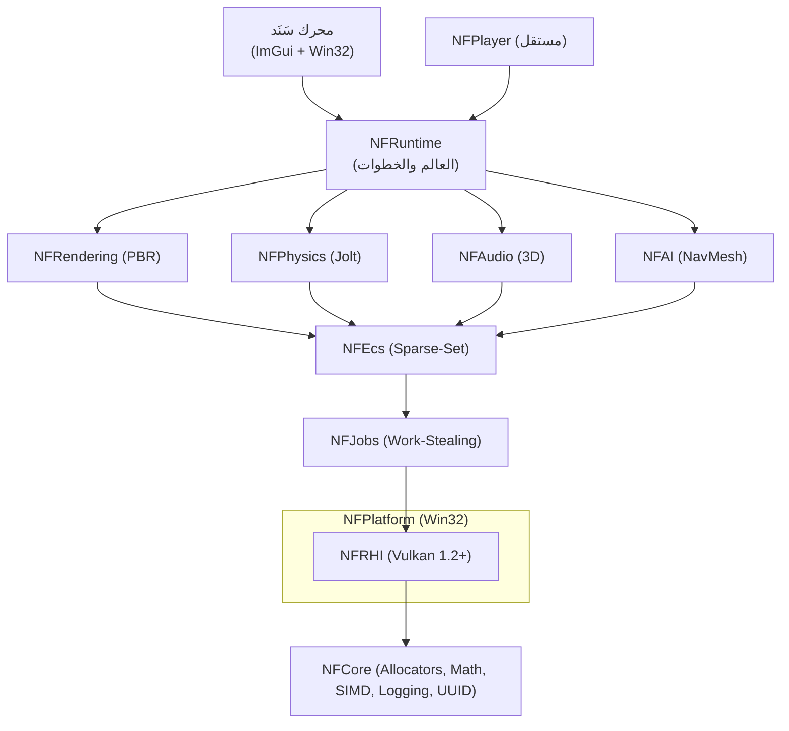

<div align="center">

  

  # محرك سَنَد | SANAD Engine

  <div dir="rtl">

  **محرك ألعاب ثلاثي الأبعاد حديث بلغة C++23 ومكتبة Vulkan — ومحرر يتكلّم العربية.**
  <br>
  محرك مفتوح المصدر، عربي أولاً، مبني بمعايير هندسة معاصرة.

  <a href="https://github.com/abdallah2183/SANAD-Engine/releases"></a>
  <a href="LICENSE"></a>
  <a href="#"></a>
  <a href="#"></a>
  <a href="#"></a>
  <a href=".github/workflows/ci.yml"></a>
  <a href="#"></a>
  <a href="CONTRIBUTING.md"></a>

  <br>

  [تنزيل](https://github.com/abdallah2183/SANAD-Engine/releases) ·
  [الموقع التفاعلي](https://abdallah2183.github.io/SANAD-Engine/) ·
  [التوثيق](Docs/) ·
  [English](README.md) ·
  <!-- TODO: رابط Discord/مجتمع إن أُنشئ -->

  <br>

  <!-- TODO: سجّل GIF المحرر -> Docs/media/hero.gif (التفاصيل في Docs/media/README.md) -->
  

  </div>

</div>

---

## 🌟 لماذا محرك سَنَد؟

<div dir="rtl">

- **عربي أولاً، لا لاحقاً.** المحرر يشكّل النصوص العربية بشكل مُتحقَّق (أشكال سياقية، لام-ألف، ثنائي الاتجاه) بخط Amiri، مع تعريب كامل للإنجليزية والعربية — ميزة أساسية لا إضافة لاحقة.
- **حديث بالبناء.** C++23، واجهة Vulkan 1.2+ منخفضة الكلفة، ECS موجّه بالبيانات، و RenderGraph على شكل DAG.
- **فيزياء وتدمير حقيقيان.** محلّل حتمي + Jolt 5.6 (مركبات، ragdolls، CCD) وعالم كسر/ضرر بميزانيات حطام.
- **يعمل للمبتدئ من أول تشغيل.** `nf new` ينتج مشروعاً سكربته مربوطة أصلاً بكيان مرئي يتحرك فوراً — راجع [من وين أبدأ](Docs/Getting_Started_Ar.md).
- **بوابة صفر أخطاء.** البناء والاختبارات (1848) تعمل في CI على جهاز Vulkan برمجي.

---

## 📑 المحتويات

- [شاهدها تعمل](#-شاهدها-تعمل)
- [البدء السريع](#-البدء-السريع)
- [المزايا](#-المزايا)
- [المعمارية](#-المعمارية)
- [البناء من المصدر](#-البناء-من-المصدر)
- [ابنِ لعبة](#-ابنِ-لعبة)
- [الأمثلة](#-الأمثلة)
- [هيكل المشروع](#-هيكل-المشروع)
- [خارطة الطريق](#-خارطة-الطريق)
- [المساهمة](#-المساهمة)
- [الترخيص والشكر](#-الترخيص-والشكر)

---

## 🎬 شاهدها تعمل

<div dir="rtl">

<!-- كل ملف هنا يحتاج تسجيلاً — راجع Docs/media/README.md لقائمة اللقطات
     والدقة ومعدل الإطارات وحجم الملف. نص بديل لكل صورة. -->

| | |
|:---:|:---|
| **محرر عربي RTL**<br>تشكيل سياقي، لام-ألف، ثنائي الاتجاه.<br><!-- TODO: سجّل -> Docs/media/editor_rtl.gif --><br> | **تصييم PBR مؤجل / ظلال / إضاءة IBL**<br>GGX، ظلال متتالية، IBL من السماء.<br><!-- TODO: سجّل -> Docs/media/rendering.gif --><br> |
| **عرض المركبات**<br>مركبة Jolt + صناديق قابلة للتدمير.<br><!-- TODO: سجّل -> Docs/media/vehicle.gif --><br> | **CliffStory ثنائية الأبعاد**<br>حكاية الجرف — 65 حرفاً، من الغروب للليل.<br><!-- TODO: سجّل -> Docs/media/cliffstory.gif --><br> |

لقطات ثابتة (متوفرة اليوم): [محرر EN](Docs/images/shot_editor_en.png) · [محرر AR](Docs/images/shot_editor_ar.png) · [مركبة](Docs/images/shot_vehicle.png) · [لعبة](Docs/images/shot_game.png)

</div>

---

## 🚀 البدء السريع

<div dir="rtl">

نزّل أحدث نسخة لنظام **Windows 10/11 x64**، ثم شغّلها.

| الملف | كيف تستخدمه |
|:---|:---|
| `SANAD-*-Setup.exe` (مستحسن) | نقرة مزدوجة → معالج (English / العربية) → اختصار في قائمة البدء |
| `SANAD-*-Portable.zip` | فكّ الضغط في أي مكان → شغّل `SANADEditor.exe` |

```bat
:: ابنِ لعبتك الأولى بثلاثة أوامر
nf.exe new MyGame --template ThirdPerson
nf.exe build --project MyGame\MyGame.nfproj
cd MyGame\dist && NFPlayer.exe
```

> [!NOTE]
> يلزم تعريف GPU يدعم Vulkan. ملف `vulkan-1.dll` يأتي **مع التعريف لا مع الحزمة** (نسخة مُجمَّعة أقدم من التعريف تُسبب شاشة سوداء). المحرر يبلّغ بوضوح إن كان مفقوداً.

> [!WARNING]
> هذه النسخة **لـ Windows x64 فقط** — لا Linux/macOS بعد.

</div>

---

## ✨ المزايا

| الفئة | ما تفعله |
|:---|:---|
| **التصيير** | خلفية Vulkan 1.2+ منخفضة الكلفة، RenderGraph على شكل DAG، PBR مؤجل (GBuffer، GGX، ظلال متتالية، سماء إجرائية)، IBL من السماء (split-sum)، SSAO (نصف دقة + تمويه ثنائي)، حزمة لاحقة (bloom، تصحيح ألوان، tonemap، vignette)، التقاط GPU، LOD |
| **الفيزياء** | محلّل حتمي (دفعات، SAT، احتكاك) + Jolt 5.6 (مركبات، ragdolls، استعلامات، CCD، خرائط ارتفاعات، أجسام مركّبة) + قماش PBD |
| **البرمجة** | Lua 5.4 معزول (`nf.*`، ربط كيانات) + C# عبر استضافة .NET 10 |
| **الصوت** | صوت مكاني ثلاثي الأبعاد (WASAPI)؛ استيراد WAV/OGG/MP3/FLAC |
| **الشبكات** | UDP + قناة موثوقة، لقطات، سيرفر authoritative، تنبؤ ومصالحة العميل |
| **اللعب والذكاء** | وسوم، مهام، مخزون، حوارات، إعادة تشغيل مُدخلات؛ A* شبكي + أشجار سلوك؛ NavMesh بمسارات تتفادى العوائق |
| **التدمير** | أصول كسر، عالم ضرر بميزانيات، مصرف حطام Jolt |
| **ثنائي الأبعاد (`NFScene2D`)** | CPU فقط: كاميرات، دفعة sprites، خريطة بلاط، فيزياء 2D، A* |
| **المحرر** | هيكل ImGui مع إرساء، شجرة مشهد، مفتش منعكس، مقابض، تراجع/إعادة، **واجهة عربية RTL** |
| **الأدوات** | سطر أوامر `nf` (`new/build/verify/run`)، AssetCooker، ModelImporter، Player، ProjectTool |

<details>
<summary><b>التفاصيل الكاملة</b></summary>

<div dir="rtl">

- **الأصول:** قارئ واحد لـ `.gltf/.glb/.obj/.stl/.ply/.nfmesh` → `.nfmesh`، مع المواد والخامات ([Asset_Import.md](Docs/Asset_Import.md)).
- **التحريك:** مقاطع، آلة حالة مع تلاشٍ، مقاطع إجرائية، IK بعظمتين.
- **الواجهة العربية:** مشكّل مُتحقَّق (أشكال، لام-ألف، bidi)، خط Amiri، تعريب كامل.
- بوابات الجودة: بناء نظيف `/W4 /WX`، صفر أخطاء تحقق Vulkan، صفر تسريبات، اختبار مشروع من طرف لطرف.

</div>

</details>

---

## 🏗 المعمارية



<details>
<summary><b>نسخة ASCII</b></summary>

```
┌─────────────────────────────────────────────────────────────────┐
│               SANAD Editor (ImGui + Win32 Docking)          │
├───────────────────────────────┬─────────────────────────────────┤
│    Gameplay Module Registry   │      NFPlayer Standalone        │
├───────────────────────────────┴─────────────────────────────────┤
│                   NFRuntime (World & Stepping)                  │
├──────────────────────┬─────────────────────────┬────────────────┤
│  NFRendering (PBR)   │   NFPhysics (Jolt)       │ NFAudio (3D)   │
├──────────────────────┴─────────────────────────┴────────────────┤
│         NFEcs (Sparse-Set) & NFScene (Hierarchical Graph)       │
├─────────────────────────────────────────────────────────────────┤
│            NFJobs (Work-Stealing Multi-threaded Graph)          │
├─────────────────────────────────────────────────────────────────┤
│    NFRHI (Vulkan 1.2+ Low Overhead) & NFPlatform (Win32)        │
├─────────────────────────────────────────────────────────────────┤
│     NFCore (Custom Allocators, Pure Math, SIMD, Logging, UUID)  │
└─────────────────────────────────────────────────────────────────┘
```

</details>

الفصل الطبقي مفروض عبر `Scripts/check_layering.sh` في CI.

---

## 🔧 البناء من المصدر

**المتطلبات:** Windows 10/11 x64 · Visual Studio 2022/2026 (MSVC + C++23) · CMake 3.25+ · Ninja · Vulkan SDK 1.3+ (`glslc` على `PATH`).

```bash
git clone https://github.com/abdallah2183/SANAD-Engine.git
cd SANAD-Engine
build_nf.bat
```

التشغيل والاختبار:

```bat
.\build\DebugNinja\bin\SANADEditor.exe
.\build\DebugNinja\bin\RuntimeTests.exe
```

<details>
<summary><b>بناء يدوي بـ CMake</b></summary>

```bash
cmake -S . -B build/DebugNinja -G Ninja -DCMAKE_BUILD_TYPE=Debug ^
      -DNF_BUILD_TESTS=ON -DNF_BUILD_SAMPLES=ON -DNF_BUILD_TOOLS=ON -DNF_BUILD_EDITOR=ON
cmake --build build/DebugNinja --parallel
```

</details>

نسخة Release + مثبّت EXE (ما يُنشر في GitHub Release):

```powershell
powershell -ExecutionPolicy Bypass -File packaging/windows/build_installer.ps1
```

---

## 🎮 ابنِ لعبة

```bat
.\build\DebugNinja\bin\nf.exe new MyGame --name MyGame --template ThirdPerson
.\build\DebugNinja\bin\nf.exe build --project MyGame\MyGame.nfproj
cd MyGame\dist && .\NFPlayer.exe
```

- استورد النماذج عبر `File > Import` أو `NFModelImporter.exe` ([الصيغ](Docs/Asset_Import.md)).
- شخصيات Blender: صدّر بالإضافة المرفقة ([خط الأنابيب](Docs/Blender_Pipeline.md)).
- جديد هنا؟ [دليل 20 دقيقة](Docs/Tutorial_Ar.md) · [من وين أبدأ](Docs/Getting_Started_Ar.md) · [برمجة Lua](Docs/Lua_Scripting_Ar.md).
- القوالب: `Default`، `ThirdPerson`، `FPSStarter`، `Platformer2D`.

---

## 🧩 الأمثلة

شغّلها من `build/*/bin/`؛ معظمها يقبل `--frames N` لتشغيل محدود.

| النموذج | ما يظهر |
|:---|:---|
| `NFSampleCliffStory` — حكاية الجرف | قصة تسلّق ثنائية كاملة على `NFScene2D` (65 حرفاً، من الغروب للليل، نص عربي مشكّل) |
| `NFSampleVehicleDemo` | مركبة Jolt، كاميرا تتبّع، صناديق قابلة للتدمير |
| أخرى | Triangle، Basic3D، Water، Audio، Animation، GameUI، RuntimeScene، MedievalVillage، … |

---

## 📁 هيكل المشروع

```
Engine/        Core, RHI (Vulkan), Rendering, ECS, Scene, Physics, Audio, AI, …  # 23 نظاماً
Editor/        محرر ImGui + مطلق المشاريع (واجهة عربية RTL)
Tools/         nf CLI، AssetCooker، ModelImporter، Player، ProjectTool
Samples/       أمثلة قابلة للعب (CliffStory، VehicleDemo، …)
Templates/     مشاريع بداية (Default، ThirdPerson، FPSStarter، Platformer2D)
Tests/         26 مجموعة اختبار، تُشغَّل عبر Scripts/run_tests.sh
Docs/          أدلة، خطط، وثيقة التصميم، قائمة الميديا
Shaders→build/ SPIR-V تُبنى وقت البناء، تُشحن بجانب الـ exe
packaging/     مثبّت Windows (Inno Setup) + بناء نسخة محمولة
website/       موقع العرض التفاعلي
```

---

## 🗺 خارطة الطريق

المراحل 1–27 مكتملة (الأساس → LOD → ظلال/سماء → صوت/glTF → Lua+C# → Jolt+شبكات → طبقة 2D → تدمير → تتالي → SSAO → خرائط PBR → IBL). مؤخراً: **SSAO**، **خرائط PBR كاملة**، **IBL من السماء**.

<details>
<summary><b>قائمة المراحل</b></summary>

- [x] المراحل 1–3 — النواة، RHI فيulkan، Jobs، ECS
- [x] المراحل 4–6 — محرر ImGui، مفتش، مستعرض أصول، تراجع/إعادة
- [x] المراحل 7–8 — PBR مؤجل، RenderGraph، مواد
- [x] المراحل 9–10 — فيزياء حتمية، تحريك هيكلي، صوت 3D
- [x] المرحلة 11 — فصل الطبقات، حفظ متقدم، بث عوالم
- [x] المرحلة 12 — LOD وبث الشبكات
- [x] المرحلة 13 — ظلال اتجاهية + سماء إجرائية
- [x] المرحلة 14 — MiniAudio + استيراد glTF 2.0
- [x] المرحلة 15 — Lua + C#، محرر عربي RTL
- [x] المرحلة 16 — فيزياء Jolt + لاعب متعدد
- [x] المرحلة 17 — نسخ الأجسام والمفاصل
- [x] المرحلة 18 — طبقة 2D (`NFScene2D`)
- [x] المرحلة 19 — التدمير
- [x] المرحلة 20 — ظلال متتالية
- [x] المرحلة 21 — ظلال محلية نقطية/شعاعية
- [x] المرحلة 22 — نواة الذكاء (إدراك، آلات حالة، ذكاء فائدة)
- [x] المراحل 24–25 — سكربت المشهد، جزيئات/قماش/شخصية
- [x] المرحلة 27 — حزمة المعالجة اللاحقة
- [x] SSAO · خرائط PBR كاملة · IBL من السماء

</details>

التاريخ الكامل والمراحل القادمة: [ROADMAP.md](ROADMAP.md) · التصميم الكامل: [Docs/SANAD_Engine_Complete_Design.md](Docs/SANAD_Engine_Complete_Design.md).

---

## 🤝 المساهمة

Fork → فرع → بناء → صفر أخطاء تحقق → Pull Request.

تبحث عن بداية؟ القضايا الموسومة **`good first issue``** مناسبة للمبتدئين (توثيق، أمثلة، تجربة المحرر). التفاصيل: [CONTRIBUTING.md](CONTRIBUTING.md).

**نداء للمبدعين العرب:** نرحّب بمبرمجي C++ والرسوميات والفيزياء والصوتيات وواجهات المحرر وكتّاب التوثيق — المشروع مصمّم طبقياً ليتّسع للجميع.

---

## 📜 الترخيص والشكر

رخصة Apache 2.0 — راجع [LICENSE](LICENSE).

بُنِي على: **Jolt Physics**، **Dear ImGui**، خط **Amiri**، **Lua 5.4**، **miniaudio**، **stb**، **cgltf**، **.NET** (استضافة C#)، **Vulkan SDK**.

<br>

<div align="center">

<!-- TODO: تحقق من اسم المستودع قبل التمكين -->
<a href="https://star-history.com/#abdallah2183/SANAD-Engine&Date"></a>
<a href="https://contrib.rocks"></a>

</div>
