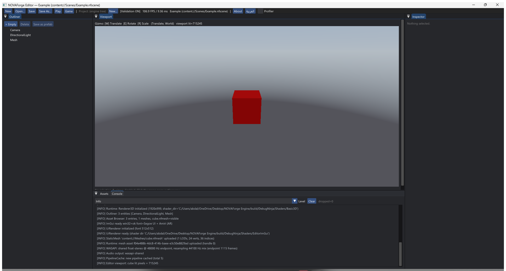
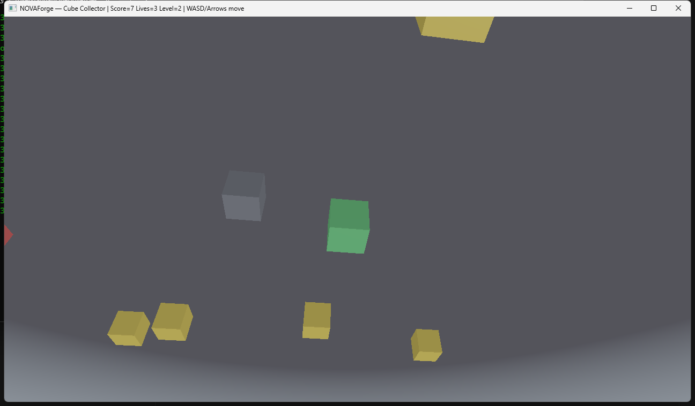
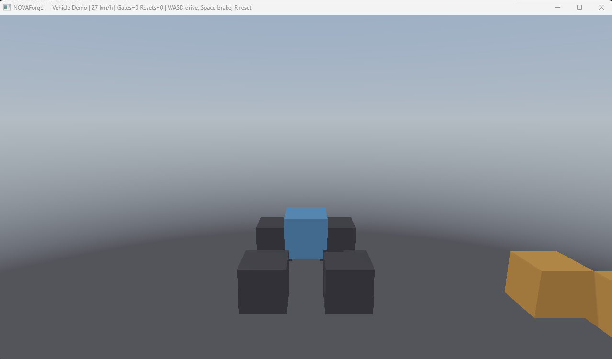

<p align="center">
  
</p>

<h1 align="center">محرك سَنَد | SANAD Engine</h1>

<p align="center">
  <strong>محرك ألعاب ثلاثي الأبعاد حديث ومفتوح المصدر مبني بلغة C++23 ومكتبة الرسوميات Vulkan</strong><br>
  <em>Modern, High-Performance C++23 & Vulkan 3D Game Engine</em>
</p>

<p align="center">
  <strong>المؤسس والقائم على العمل:</strong> <a href="https://github.com/abdallah2183"><strong>عبدالله (Abdallah)</strong></a>
</p>

<p align="center">
  <a href="#"></a>
  <a href="#"></a>
  <a href="#"></a>
  <a href="#"></a>
  <a href="#"></a>
  <a href="CONTRIBUTING.md"></a>
  <a href="LICENSE"></a>
</p>

---

## الواجهة التفاعلية والموقع التعريفي

يتوفر للمحرك موقع تفاعلي متكامل يعرض إمكانيات المحرك ومجسماً ثلاثي الأبعاد تفاعلياً:
- **الموقع المباشر:** [https://abdallah2183.github.io/SANAD-Engine/](https://abdallah2183.github.io/SANAD-Engine/)
- **الملف المحلي:** [`index.html`](index.html)

---

## لقطات حقيقية (Real Screenshots)

صور ملتقطة مباشرة من المحرر واللعبة العاملة — بدون فوتوشوب:

| محرر سند (إنجليزي) | محرر سند (عربي RTL) | لعبة جامع المكعبات | ديمو قيادة المركبة |
| :---: | :---: | :---: | :---: |
|  |  |  |  |

---

<div dir="rtl">

## نبذة عن المشروع والرؤية

**محرك سَنَد (SANAD Engine)** هو مشروع محرك ألعاب ثلاثي الأبعاد متكامل، أسسه ويقوده **عبدالله**، بهدف إرساء بنية هندسية عربية متطورة ومنافسة في مجال محركات الألعاب. تم بناء المحرك من الصفر بالاعتماد على معيار **C++23** ومكتبة الرسوميات **Vulkan 1.2+** ومعمارية الكيانات والمكونات الموجهة للبيانات (**Data-Oriented ECS**).

### نداء للمطورين والمبدعين العرب

المحرك صُمم من اليوم الأول ليكون قابلاً للتوسع والتطوير المستمر بنظام معماري منفصل الطبقات. نرحب بانضمام كافة الكفاءات العربية لبناء هذا المشروع معاً:
- مبرمجو C++ وهندسة النظم.
- مبرمجو الرسوميات ومظللات Vulkan / Direct3D.
- مهندسو الصوتيات ومعالجة الإشارات.
- مطورو المحاكاة الفيزيائية والرياضيات التطبيقية.
- مطورو واجهات المستخدم وأدوات المحرر.
- كتاب التوثيق والمصممون وصناع المحتوى.

### مجالات المساهمة والتطوير المطلوبة

1. **الرسوميات والتظليل (Vulkan & Shaders):**
   - ظلال الأضواء النقطية والكاشفة (Point/Spot Shadows)، والظلال الافتراضية (Virtual Shadow Maps).
   - نظام السماء الإجرائية وتأثيرات الإضاءة الجوية.
   - تأثيرات ما بعد المعالجة (Bloom, Tonemapping, SSAO).

2. **محرك الصوتيات (Audio Engine):**
   - استكمال دمج مكتبة MiniAudio لدعم ملفات WAV و OGG.
   - مؤثرات معالجة الصوت الموقعي ثلاثي الأبعاد.

3. **لغات البرمجة والسكربت (Scripting):**
   - دمج لغة C# أو Lua لبرمجة منطق الألعاب بسلاسة.

4. **واجهة المحرر والتعريب (Editor & UI):**
   - دعم التخطيط العربي (RTL) وتشكيل الحروف في واجهة ImGui.
   - تحسين أدوات المعاينة والمقابض الحركية (Gizmos).

5. **المحاكاة الفيزيائية المتقدمة (Physics):**
   - دمج محرك Jolt Physics لدعم تصادمات الأجسام والشبكات المعقدة.

6. **إدارة واستيراد الأصول (Asset Pipelines):**
   - بناء مستورد لنماذج glTF 2.0 و FBX وتحويلها إلى صيغة المحرك.

للتفاصيل الكاملة، يرجى مراجعة [دليل المساهمة (CONTRIBUTING.md)](CONTRIBUTING.md) و[خارطة الطريق (ROADMAP.md)](ROADMAP.md).

</div>

---

## Architecture Overview

SANAD Engine is built on a modular, decoupled architecture with a multi-threaded job scheduler and strict layering enforcement.

```
SANAD Engine Architecture
┌─────────────────────────────────────────────────────────────────┐
│               SANAD Editor (ImGui + Win32 Docking)              │
├───────────────────────────────┬─────────────────────────────────┤
│    Gameplay Module Registry   │      NFPlayer Standalone        │
├───────────────────────────────┴─────────────────────────────────┤
│                   NFRuntime (World & Stepping)                  │
├──────────────────────┬─────────────────────────┬────────────────┤
│  NFRendering (PBR)   │   NFPhysics (SAT/Imp)   │ NFAudio (3D)   │
├──────────────────────┴─────────────────────────┴────────────────┤
│         NFEcs (Sparse-Set) & NFScene (Hierarchical Graph)       │
├─────────────────────────────────────────────────────────────────┤
│            NFJobs (Work-Stealing Multi-threaded Graph)          │
├─────────────────────────────────────────────────────────────────┤
│    NFRHI (Vulkan 1.2+ Low Overhead) & NFPlatform (Win32)        │
├─────────────────────────────────────────────────────────────────┤
│     NFCore (Custom Allocators, Pure Math, SIMD, Logging, UUID)  │
└─────────────────────────────────────────────────────────────────┘
```

---

## Current Status (Phase 12–20 Verification)

- **1284 Automated Tests Passed** across 24 test suites (0 failed, 1 benchmark skipped). Verified by a full clean build + run, not a doc estimate.
- **0 Vulkan Validation Layer Errors** and zero memory leaks.
- Clean compilation under `/W4 /WX` with MSVC.
- End-to-end deterministic frame loop stepping physics, skeletal animation, 3D spatial audio, gameplay modules, Lua scripts, input replays, and scene transform hierarchies in lockstep.
- Native dockable **ImGui Editor** with Outliner, Reflected Inspector, Asset Browser, Undo/Redo, 3D Viewport, Sky/Shadow environment editing, live Profiler, and full Arabic RTL localisation.
- Virtual File System (`content://`, `cache://`, `project://`, `saves://`) and standalone CLI project tooling (`nf new`, `nf build`, `nf run`).

---

## Implemented Subsystems

| Subsystem | Description and Capabilities |
| :--- | :--- |
| **Vulkan RHI & Rendering** | Low-overhead Vulkan 1.2+ backend, DAG RenderGraph, Multi-pass Deferred PBR Pipeline (GBuffer, Cook-Torrance GGX, Directional/Point/Spot lights, **cascaded shadows** — 4 camera-fitted cascades tiled into a 2048 atlas with texel snapping, per-cascade derived bias and cross-fade blending — procedural sky, Tonemapping, GPU Picking, distance LOD + LOD generator). |
| **Data-Oriented ECS** | Cache-friendly sparse-set Entity-Component-System with high memory locality and hierarchical transform propagation. |
| **2D Scene (`NFScene2D`)** | CPU-only, Jolt-independent: y-down cameras with pixel snap, shelf atlas, sprite batcher, 16×16 signed tile chunks (auto-tile / greedy collision / octile A* / streaming), sequential-impulse 2D world (spatial hash, SAT, generation handles, distance + revolute). |
| **Destruction (`NFDestruction`)** | Fracture assets (convex-hull chunk tree, plane cuts), damage world with linear falloff and accumulated bond stress, shard emission whose volumes partition the detached region exactly, and a performance budget enforced inside `apply_damage` (per-frame break allowance, live-shard cap retiring oldest-first, lifetime expiry). Arithmetic-only behind an `IDebrisSink` seam, so the suite runs with no physics backend and no GPU; `JoltDebrisSink` implements it in `NFPhysics`. |
| **Physics Solver** | Fully deterministic rigid-body solver (Sequential Impulses, Warm Starting, Baumgarte position correction, SAT narrowphase, Coulomb friction) + dynamic-body character controller + **Jolt v5.6 advanced backend** (vehicles with per-wheel state readback and reset/respawn, ragdolls, constraints with cross-body cloning, scene queries — ray casts, sphere sweeps, sphere/box overlaps — sensor triggers, continuous collision detection, and complex colliders: capsule, convex hull, static triangle mesh) + **cloth / soft body** (first-party deterministic PBD grid: structural/shear/bend constraints, pins, wind, and sphere/box/plane collision — independent of Jolt, which has no deformable solver). |
| **Skeletal Animation** | Bone hierarchy evaluation, animation clips with slerp/lerp keyframe sampling, state machine with transitions and cross-fading, procedural clip generator, analytic two-bone IK. |
| **3D Spatial Audio** | 3D audio listener with attenuation models (Linear, Inverse, Exponential), stereo panning, WASAPI shared-mode backend, WAV/OGG/MP3/FLAC import pipeline, and headless test driver. |
| **Asset Pipeline** | glTF 2.0 importer (`.gltf`/`.glb` → `.nfmesh` via `NFModelImporter`), mesh cooking, and asset registry management. |
| **Lua + C# Scripting** | Sandboxed Lua 5.4 VM with `nf.*` host library, entity bindings, per-entity `ScriptComponent` ticking, and instruction budgets — plus .NET 10 hosting for C# (UnmanagedCallersOnly sandbox, per-entity Start/Update/Counter, host callbacks). |
| **Gameplay Framework** | Hierarchical gameplay tags + queries, staged quest log, stacked inventory, dialogue trees, deterministic input replays, and CPU profiler with Chrome-trace export. |
| **Game AI** | Deterministic grid A* pathfinding (no corner cutting, LOS smoothing) + reactive behavior trees with blackboard. |
| **VFX** | Deterministic CPU particle simulation (emission, gravity/drag, grading). |
| **Arabic UI & Localization** | UCD-verified Arabic shaper (contextual forms, lam-alef, bidi), Amiri font pipeline, and EN/AR editor localisation. |
| **World & Time** | Day/night cycle driver, procedural heightfield terrain, and multiplayer: UDP + reliable channel + snapshots + authoritative server with client prediction, plus vehicle drive-input/chassis replication and ordered constraint spawn/clone/remove events. |
| **Reflection & Serialization** | Zero-codegen reflection macros (`NF_CLASS`, `NF_PROPERTY`, `NF_ENUM`), bidirectional text serialization, and automated inspector panels. |
| **Native Editor** | Dear ImGui docking shell, scene outliner, entity inspector, live viewport gizmos, undo/redo command history, and game save manager. |
| **Build & Packaging CLI** | `nf` CLI tool supporting project templating, cooking, asset registry management, and single-directory relocatable standalone distribution. |

---

## Quick Start and Build Instructions

### Prerequisites
- **Operating System:** Windows 10 / 11 (64-bit)
- **Compiler:** Visual Studio 2022 / 2026 (MSVC 19.40+) with C++23 support
- **Build Tools:** CMake 3.25+ and Ninja
- **Graphics SDK:** Vulkan SDK 1.3+ with `glslc` on your `PATH`

### 1. Clone the Repository
```bash
git clone https://github.com/abdallah2183/SANAD-Engine.git
cd SANAD-Engine
```

### 2. Build the Engine
Run the automated build script:
```cmd
build_nf.bat
```

Or configure and build directly via CMake:
```bash
cmake -S . -B build/DebugNinja -G Ninja -DCMAKE_BUILD_TYPE=Debug -DNF_BUILD_TESTS=ON -DNF_BUILD_SAMPLES=ON -DNF_BUILD_EDITOR=ON
cmake --build build/DebugNinja --parallel
```

### 3. Run the Editor
```cmd
.\build\DebugNinja\bin\NOVAForgeEditor.exe
```

### 4. Run Automated Tests
```cmd
.\build\DebugNinja\bin\EditorTests.exe
.\build\DebugNinja\bin\RHITests.exe
.\build\DebugNinja\bin\RuntimeTests.exe
```

### 5. Create and Package a Project
```cmd
# Create a new project from template
.\build\DebugNinja\bin\nf.exe new MyGame --name MyGame

# Cook assets and package standalone binary
.\build\DebugNinja\bin\nf.exe build --project MyGame/MyGame.nfproj

# Run standalone game player
cd MyGame/dist && .\NFPlayer.exe
```

### 6. Import a Blender Character
Export from Blender with the shipped add-on, then cook the `.glb`:
```cmd
.\build\DebugNinja\bin\NFModelImporter.exe --input Hero.glb --info
.\build\DebugNinja\bin\NFModelImporter.exe --input Hero.glb --output Content/Meshes/Hero.nfmesh
```
Full walkthrough (add-on install, export settings, round trip, current gaps):
[`Docs/Blender_Pipeline.md`](Docs/Blender_Pipeline.md)

### First time here?
- **New to the engine?** [`Docs/Tutorial.ar.md`](Docs/Tutorial.ar.md) — a 20-minute
  Arabic walkthrough from an empty machine to a built, runnable game, with
  screenshots.
- **Starting a game?** `Templates/` ships four project trees — `Default`,
  `ThirdPerson`, `FPSStarter`, `Platformer2D`. Every one of them scaffolds into a
  project that loads and plays (pinned by `Tests/ToolTests/test_templates.cpp`).

---

## Project Roadmap

- **Phase 1–11:** Core Engine Foundation (Completed)
- **Phase 12:** Dynamic Mesh LOD Generation & Model Importer (Completed)
- **Phase 13:** Directional Shadow Mapping (PCF 3x3) & Procedural Sky Atmosphere (Completed)
- **Phase 14:** Compressed Audio Import (WAV/OGG/MP3/FLAC) & glTF 2.0 Asset Importer (Completed)
- **Phase 15:** Lua Scripting Integration (Completed) + C# Scripting via .NET 10 Hosting (Completed) & Arabic RTL Editor Localisation (Completed)
- **Phase 16:** Jolt Physics Backend (Completed) + UDP/Reliable/Snapshots + Authoritative Server & Prediction (Completed) — vehicle wheel-state readback/reset and cross-body constraint cloning (Completed) — vehicle/constraint network replication: drive inputs, chassis snapshots, joint events (Completed) — C# bindings (Completed)
- **Phase 17:** Body & joint replication over the wire (vehicle orientation snapshots, body registry, constraint applier) (Completed)
- **Phase 18:** Independent 2D layer (`NFScene2D`) — deterministic atlas/batcher, signed-chunk tilemaps, sequential-impulse 2D physics (circle/box, distance/revolute), `Scene2DTests` 37/37 (Completed)
- **Phase 19:** Destruction — fracture geometry & chunk assets, damage world, debris budgets, `IDebrisSink` seam with a Jolt implementation, and a `Destructible:` component in `.nfscene` that cooks, binds and shatters from impact with no game code (Completed)
- **Phase 20:** Cascaded Shadow Maps — camera-fitted shadow cascades in a 2x2 atlas, per-cascade derived bias, texel snapping, cross-fade blending (Completed)

Full details are documented in [ROADMAP.md](ROADMAP.md).

---

## المساهمة في التطوير

نرحب بكافة المساهمات وفق الخطوات التالية:
1. عمل **Fork** للمستودع.
2. إنشاء فرع عمل جديد (`git checkout -b feature/your-feature`).
3. بناء المشروع والتأكد من نجاح جميع الاختبارات (`build_nf.bat`).
4. التأكد من خلو تشغيل Vulkan من أي أخطاء في طبقات الفحص (Zero Validation Errors).
5. فتح **Pull Request** مع توضيح مفصل للتغييرات.

للمزيد من الإرشادات، يرجى قراءة [دليل المساهمة (CONTRIBUTING.md)](CONTRIBUTING.md).

---

## License

This project is licensed under the Apache License, Version 2.0. See the [LICENSE](LICENSE) file for details.

---

<p align="center">
  <strong>المؤسس والقائم على العمل:</strong> <a href="https://github.com/abdallah2183"><strong>عبدالله (Abdallah)</strong></a><br>
  <em>Founder & Project Lead: Abdallah (@abdallah2183) & Community Contributors</em>
</p>
