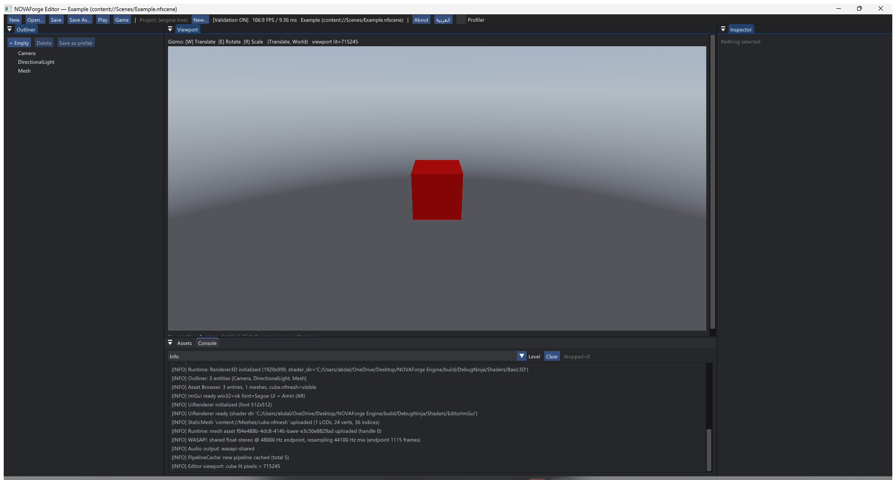
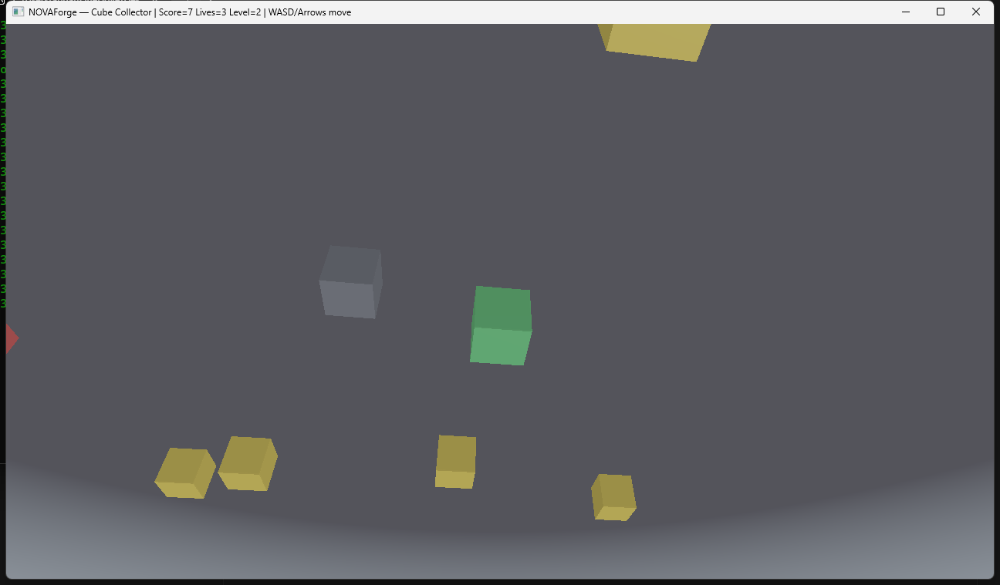
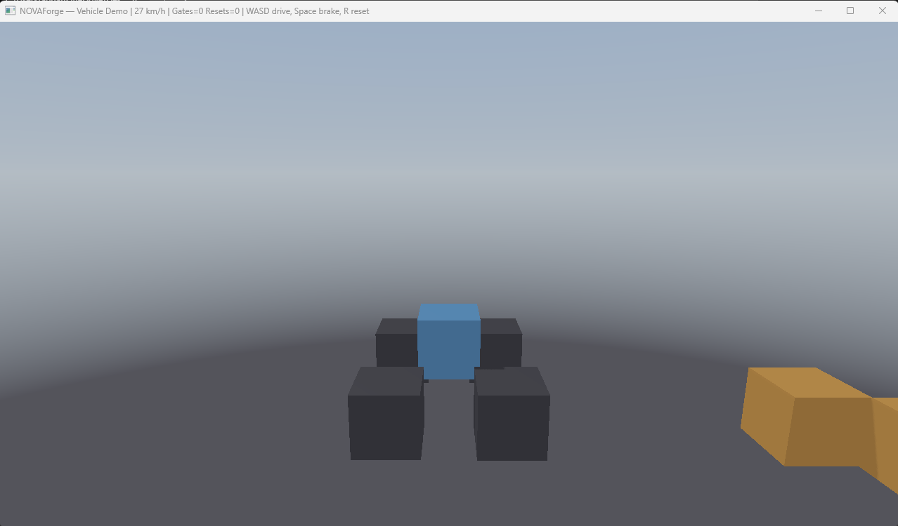

<p align="center">
  
</p>

<h1 align="center">NOVAForge Engine | محرك سَنَد</h1>

<p align="center">
  <strong>Modern, high-performance C++23 &amp; Vulkan 3D game engine with an Arabic-first editor.</strong><br>
  محرك ألعاب ثلاثي الأبعاد حديث ومفتوح المصدر — بلغة C++23 ومكتبة Vulkan، وبمحرر يتكلم العربية.
</p>

<p align="center">
  <strong>Founder &amp; Project Lead:</strong> <a href="https://github.com/abdallah2183">Abdallah (عبدالله)</a>
</p>

<p align="center">
  <a href="https://github.com/abdallah2183/SANAD-Engine/releases"></a>
  <a href="LICENSE"></a>
  <a href="#"></a>
  <a href="#"></a>
  <a href="#"></a>
  <a href="CONTRIBUTING.md"></a>
</p>

<p align="center">
  <a href="https://github.com/abdallah2183/SANAD-Engine/releases"><strong>⬇ Download Beta (Windows x64)</strong></a>
  &nbsp;·&nbsp;
  <a href="https://abdallah2183.github.io/SANAD-Engine/">🌐 Live showcase</a>
  &nbsp;·&nbsp;
  <a href="README.ar.md">📖 النسخة العربية</a>
</p>

---

## Contents

- [Screenshots](#screenshots)
- [Download &amp; Run](#download--run)
- [Features](#features)
- [Architecture](#architecture)
- [Build from Source](#build-from-source)
- [Make a Game](#make-a-game)
- [Samples](#samples)
- [Project Structure](#project-structure)
- [Roadmap](#roadmap)
- [Contributing](#contributing)
- [License](#license)

---

## Screenshots

Real captures from the editor and running games — no Photoshop:

| Editor (English) | Editor (Arabic RTL) | Cube Collector | Vehicle Demo |
| :---: | :---: | :---: | :---: |
|  |  |  |  |

---

## Download &amp; Run

Latest beta: [**v0.2.0-beta.1 → Releases page**](https://github.com/abdallah2183/SANAD-Engine/releases).
Windows 10+ **x64 only** — no Linux/macOS in this beta.

| File | How to use |
| :--- | :--- |
| `NOVAForge-*-Setup.exe` (recommended) | Double-click → wizard (English / العربية) → Start Menu shortcut |
| `NOVAForge-*-Portable.zip` | Extract anywhere → run `NOVAForgeEditor.exe` |

Requirements:

- A Vulkan-capable GPU driver. `vulkan-1.dll` ships **with the driver, not the package** (deliberately — a bundled loader older than the driver causes black screens). The installer warns, and the editor reports plainly, if it is missing.
- Nothing else — the MSVC runtime is linked statically.

---

## Features

| Subsystem | What it does |
| :--- | :--- |
| **Vulkan RHI &amp; Rendering** | Low-overhead Vulkan 1.2+ backend, DAG RenderGraph, deferred PBR (GBuffer, GGX, cascaded shadows, procedural sky), post stack (bloom, grading, tonemap, vignette), GPU picking, LOD |
| **Data-Oriented ECS** | Cache-friendly sparse-set ECS with hierarchical transform propagation |
| **2D Layer (`NFScene2D`)** | CPU-only 2D: cameras, sprite batcher, tile chunks, 2D physics, A\* |
| **Destruction** | Fracture assets, damage world with budgets, Jolt debris sink |
| **Physics** | Deterministic solver (impulses, SAT, friction) + Jolt 5.6 backend (vehicles, ragdolls, queries, CCD) + PBD cloth |
| **Animation** | Clips, state machine with cross-fade, procedural clips, two-bone IK |
| **Audio** | 3D spatial audio (WASAPI), WAV/OGG/MP3/FLAC import |
| **Assets** | One reader for `.gltf/.glb/.obj/.stl/.ply/.nfmesh` → `.nfmesh`, with materials &amp; textures ([details](Docs/Asset_Import.md)) |
| **Scripting** | Sandboxed Lua 5.4 + C# via .NET hosting |
| **Gameplay** | Tags, quests, inventory, dialogue, input replays, profiler |
| **Game AI** | Grid A\* + behavior trees with blackboard |
| **Networking** | UDP + reliable channel, snapshots, authoritative server, prediction |
| **Arabic UI** | UCD-verified shaper (forms, lam-alef, bidi), Amiri font, full EN/AR localisation |
| **Editor** | ImGui docking shell, outliner, reflected inspector, gizmos, undo/redo, save manager |
| **CLI (`nf`)** | `nf new / build / verify / run` — scaffold, cook, package, run |

Quality gates: clean `/W4 /WX` build, 0 Vulkan validation errors, 0 RHI leaks, end-to-end project test (create → build → package → run standalone).

---

## Architecture

```
┌─────────────────────────────────────────────────────────────────┐
│               NOVAForge Editor (ImGui + Win32 Docking)          │
├───────────────────────────────┬─────────────────────────────────┤
│    Gameplay Module Registry   │      NFPlayer Standalone        │
├───────────────────────────────┴─────────────────────────────────┤
│                   NFRuntime (World & Stepping)                  │
├──────────────────────┬─────────────────────────┬────────────────┤
│  NFRendering (PBR)   │   NFPhysics (SAT/Imp)   │ NFAudio (3D)   │
├──────────────────────┴─────────────────────────┴────────────────┤
│         NFEcs (Sparse-Set) & NFScene (Hierarchical Graph)       │
├─────────────────────────────────────────────────────────────────┤
│            NFJobs (Work-Stealing Multi-threaded Graph)          │
├─────────────────────────────────────────────────────────────────┤
│    NFRHI (Vulkan 1.2+ Low Overhead) & NFPlatform (Win32)        │
├─────────────────────────────────────────────────────────────────┤
│     NFCore (Custom Allocators, Pure Math, SIMD, Logging, UUID)  │
└─────────────────────────────────────────────────────────────────┘
```

Strict layering is enforced by `Scripts/check_layering.sh` in CI.

---

## Build from Source

Prerequisites: Windows 10/11 x64 · Visual Studio 2022/2026 (MSVC + C++23) · CMake 3.25+ · Ninja · Vulkan SDK 1.3+ (`glslc` on `PATH`).

```bat
git clone https://github.com/abdallah2183/SANAD-Engine.git
cd SANAD-Engine
build_nf.bat
```

Or manually:

```bash
cmake -S . -B build/DebugNinja -G Ninja -DCMAKE_BUILD_TYPE=Debug -DNF_BUILD_TESTS=ON -DNF_BUILD_SAMPLES=ON -DNF_BUILD_TOOLS=ON -DNF_BUILD_EDITOR=ON
cmake --build build/DebugNinja --parallel
```

Run / test:

```bat
.\build\DebugNinja\bin\NOVAForgeEditor.exe
.\build\DebugNinja\bin\EditorTests.exe
```

Release + installer EXE (what the GitHub Release ships):

```powershell
powershell -ExecutionPolicy Bypass -File packaging/windows/build_installer.ps1
```

---

## Make a Game

```bat
.\build\DebugNinja\bin\nf.exe new MyGame --name MyGame --template ThirdPerson
.\build\DebugNinja\bin\nf.exe build --project MyGame/MyGame.nfproj
cd MyGame/dist && .\NFPlayer.exe
```

- Import models via `File > Import`, or `NFModelImporter.exe` ([format table &amp; rules](Docs/Asset_Import.md)).
- Blender characters: export with the shipped add-on, validate with `--character` ([pipeline walkthrough](Docs/Blender_Pipeline.md)).
- New here? [20-minute Arabic tutorial](Docs/Tutorial_Ar.md) — empty machine → runnable game.
- Templates: `Default`, `ThirdPerson`, `FPSStarter`, `Platformer2D` (`nf new --template <name>`).

---

## Samples

Run from `build/*/bin/`; most accept `--frames N` for bounded runs.

| Sample | Shows |
| :--- | :--- |
| `NFSampleCliffStory` — حكاية الجرف | Complete 2D story-climb on `NFScene2D` (65 ledges, dusk→night, shaped Arabic text). [Its README](Samples/CliffStory/README.md) |
| `NFSampleVehicleDemo` | Jolt vehicle, chase camera, destructible crates |
| Others | Triangle, Basic3D, Water, Audio, Animation, GameUI, RuntimeScene, … |

---

## Project Structure

```
Engine/        Core, RHI (Vulkan), Rendering, ECS, Scene, Physics, Audio, …
Editor/        ImGui editor + project launcher
Tools/         nf CLI, AssetCooker, ModelImporter, Player
Samples/       Playable demos (CliffStory, VehicleDemo, …)
Templates/     Starter projects (Default, ThirdPerson, FPSStarter, Platformer2D)
Tests/         24 suites, run via Scripts/run_tests.sh
Docs/          Guides, plans, full design doc
Shaders→build/ SPIR-V compiled at build time, shipped beside the exe
packaging/     Windows installer (Inno Setup) + portable zip builder
website/ + index.html   Interactive showcase site
```

---

## Roadmap

Phases 1–20 complete (foundation → LOD → shadows/sky → audio/glTF → Lua+C# → Jolt+netcode → 2D layer → destruction → cascades).
Full history and next phases: [ROADMAP.md](ROADMAP.md) · full design: [Docs/NOVAForge_Engine_Complete_Design.md](Docs/NOVAForge_Engine_Complete_Design.md).

---

## Contributing

Fork → branch → build → zero validation errors → pull request.
Details: [CONTRIBUTING.md](CONTRIBUTING.md).

**نداء للمبدعين العرب:** نرحب بمبرمجي C++ والرسوميات والفيزياء والصوتيات وواجهات المحرر وكتّاب التوثيق — المشروع مصمم طبقياً ليتسع للجميع.

---

## License

Apache License 2.0 — see [LICENSE](LICENSE).
