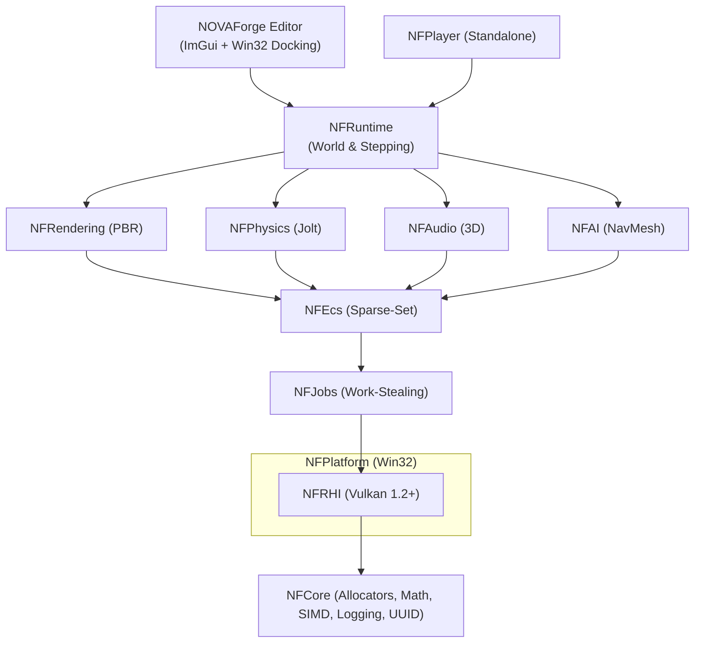

<div align="center">

  

  # NOVAForge Engine | محرك سَنَد

  **A modern C++23 + Vulkan 3D game engine — with an Arabic-first editor.**
  <br>
  محرك ألعاب ثلاثي الأبعاد حديث بلغة C++23 ومكتبة Vulkan — ومحرر يتكلّم العربية.

  <a href="https://github.com/abdallah2183/SANAD-Engine/releases"></a>
  <a href="LICENSE"></a>
  <a href="#"></a>
  <a href="#"></a>
  <a href="#"></a>
  <a href=".github/workflows/ci.yml"></a>
  <a href="#"></a>
  <a href="CONTRIBUTING.md"></a>

  <br>

  [Download](https://github.com/abdallah2183/SANAD-Engine/releases) ·
  [Live Showcase](https://abdallah2183.github.io/SANAD-Engine/) ·
  [Docs](Docs/) ·
  [العربية](README.ar.md) ·
  <!-- TODO: Discord/community link if one is created -->

  <br>

  <!-- TODO: record editor hero GIF -> Docs/media/hero.gif (see Docs/media/README.md) -->
  

</div>

---

## 🌟 Why NOVAForge?

- **Arabic-first, not Arabic-later.** The editor ships a UCD-verified Arabic text shaper (contextual forms, lam-alef ligatures, full bidi) with the Amiri font and complete EN/AR localization — first-class, not a bolt-on.
- **Modern by construction.** C++23, Vulkan 1.2+ low-overhead RHI, a data-oriented sparse-set ECS, and a DAG RenderGraph.
- **Real physics & real destruction.** Deterministic solver + Jolt 5.6 backend (vehicles, ragdolls, CCD) plus a fracture/damage world with debris budgets.
- **Beginner-runnable.** `nf new` produces a project whose starter script is already wired to a visible entity and moves on the first run — see [Getting Started](Docs/Getting_Started_Ar.md).
- **Zero-validation bar.** CI builds and runs the full suite (1848 tests) with a software Vulkan device.

---

## 📑 Table of Contents

- [See it in action](#-see-it-in-action)
- [Quick Start](#-quick-start)
- [Features](#-features)
- [Architecture](#-architecture)
- [Build from Source](#-build-from-source)
- [Make a Game](#-make-a-game)
- [Samples](#-samples)
- [Project Structure](#-project-structure)
- [Roadmap](#-roadmap)
- [Contributing](#-contributing)
- [License & Acknowledgements](#-license--acknowledgements)

---

## 🎬 See it in action

<!-- Every file here must be recorded — see Docs/media/README.md for the shot list,
     resolution, fps and size budget. Alt text on every image. -->

| | |
|:---:|:---|
| **Arabic RTL editor**<br>Contextual shaping, lam-alef, bidi.<br><!-- TODO: record -> Docs/media/editor_rtl.gif --><br> | **Deferred PBR / shadows / IBL**<br>GGX, cascaded shadows, sky-baked IBL.<br><!-- TODO: record -> Docs/media/rendering.gif --><br> |
| **Vehicle demo**<br>Jolt vehicle + destructible crates.<br><!-- TODO: record -> Docs/media/vehicle.gif --><br> | **CliffStory 2D**<br>حكاية الجرف — 65 ledges, dusk→night.<br><!-- TODO: record -> Docs/media/cliffstory.gif --><br> |

Static captures (available today): [editor EN](Docs/images/shot_editor_en.png) · [editor AR](Docs/images/shot_editor_ar.png) · [vehicle](Docs/images/shot_vehicle.png) · [game](Docs/images/shot_game.png)

---

## 🚀 Quick Start

Download the latest release for **Windows 10/11 x64**, then run it.

| File | How to use |
|:---|:---|
| `NOVAForge-*-Setup.exe` (recommended) | Double-click → wizard (English / العربية) → Start Menu shortcut |
| `NOVAForge-*-Portable.zip` | Extract anywhere → run `NOVAForgeEditor.exe` |

```bat
:: build your first game in three commands
nf.exe new MyGame --template ThirdPerson
nf.exe build --project MyGame\MyGame.nfproj
cd MyGame\dist && NFPlayer.exe
```

> [!NOTE]
> A Vulkan-capable GPU driver is required. `vulkan-1.dll` ships **with the driver, not the package** (a bundled loader older than the driver causes black screens). The editor reports plainly if it is missing.

> [!WARNING]
> This release is **Windows x64 only** — no Linux/macOS yet.

---

## ✨ Features

| Category | What it does |
|:---|:---|
| **Rendering** | Vulkan 1.2+ low-overhead backend, DAG RenderGraph, deferred PBR (GBuffer, GGX, cascaded shadows, procedural sky), sky-baked IBL (split-sum), SSAO (half-res + bilateral blur), post stack (bloom, grading, tonemap, vignette), GPU picking, LOD |
| **Physics** | Deterministic solver (impulses, SAT, friction) + Jolt 5.6 backend (vehicles, ragdolls, queries, CCD, heightfields, compound bodies) + PBD cloth |
| **Scripting** | Sandboxed Lua 5.4 (`nf.*` API, entity bindings) + C# via .NET 10 hosting |
| **Audio** | 3D spatial audio (WASAPI); WAV/OGG/MP3/FLAC import |
| **Networking** | UDP + reliable channel, snapshots, authoritative server, client prediction & reconciliation |
| **Gameplay & AI** | Tags, quests, inventory, dialogue, input replays; grid A* + behavior trees; NavMesh with obstacle-aware pathfinding |
| **Destruction** | Fracture assets, damage world with budgets, Jolt debris sink |
| **2D (`NFScene2D`)** | CPU-only: cameras, sprite batcher, tile chunks, 2D physics, A* |
| **Editor** | ImGui docking shell, outliner, reflected inspector, gizmos, undo/redo, **Arabic RTL UI** |
| **Tools** | `nf` CLI (`new/build/verify/run`), AssetCooker, ModelImporter, Player, ProjectTool |

<details>
<summary><b>Full feature detail</b></summary>

- **Assets:** one reader for `.gltf/.glb/.obj/.stl/.ply/.nfmesh` → `.nfmesh`, with materials & textures ([Asset_Import.md](Docs/Asset_Import.md)).
- **Animation:** clips, state machine with cross-fade, procedural clips, two-bone IK.
- **Arabic UI:** UCD-verified shaper (forms, lam-alef, bidi), Amiri font, full EN/AR localization.
- Quality gates: clean `/W4 /WX` build, 0 Vulkan validation errors, 0 RHI leaks, end-to-end project test (create → build → package → run standalone).

</details>

---

## 🏗 Architecture


```mermaid
flowchart TD
    Editor["NOVAForge Editor<br/>(ImGui + Win32 Docking)"]
    Player["NFPlayer (Standalone)"]
    Editor --> Runtime["NFRuntime<br/>(World & Stepping)"]
    Player --> Runtime
    Runtime --> Rendering["NFRendering (PBR)"]
    Runtime --> Physics["NFPhysics (Jolt)"]
    Runtime --> Audio["NFAudio (3D)"]
    Runtime --> AI["NFAI (NavMesh)"]
    Rendering --> ECS["NFEcs (Sparse-Set)"]
    Physics --> ECS
    Audio --> ECS
    AI --> ECS
    ECS --> Jobs["NFJobs (Work-Stealing)"]
    Jobs --> RHI["NFRHI (Vulkan 1.2+)"]
    RHI --> Core["NFCore (Allocators, Math, SIMD, Logging, UUID)"]
    subgraph Platform["NFPlatform (Win32)"]
        RHI
    end
```

<details>
<summary><b>ASCII fallback</b></summary>

```
┌─────────────────────────────────────────────────────────────────┐
│               NOVAForge Editor (ImGui + Win32 Docking)          │
├───────────────────────────────┬─────────────────────────────────┤
│    Gameplay Module Registry   │      NFPlayer Standalone        │
├───────────────────────────────┴─────────────────────────────────┤
│                   NFRuntime (World & Stepping)                  │
├──────────────────────┬─────────────────────────┬────────────────┤
│  NFRendering (PBR)   │   NFPhysics (Jolt)       │ NFAudio (3D)   │
├──────────────────────┴─────────────────────────┴────────────────┤
│         NFEcs (Sparse-Set) & NFScene (Hierarchical Graph)       │
├─────────────────────────────────────────────────────────────────┤
│            NFJobs (Work-Stealing Multi-threaded Graph)          │
├─────────────────────────────────────────────────────────────────┤
│    NFRHI (Vulkan 1.2+ Low Overhead) & NFPlatform (Win32)        │
├─────────────────────────────────────────────────────────────────┤
│     NFCore (Custom Allocators, Pure Math, SIMD, Logging, UUID)  │
└─────────────────────────────────────────────────────────────────┘
```

</details>

Strict layering is enforced by `Scripts/check_layering.sh` in CI.

---

## 🔧 Build from Source

**Prerequisites:** Windows 10/11 x64 · Visual Studio 2022/2026 (MSVC + C++23) · CMake 3.25+ · Ninja · Vulkan SDK 1.3+ (`glslc` on `PATH`).

```bash
git clone https://github.com/abdallah2183/SANAD-Engine.git
cd SANAD-Engine
build_nf.bat
```

Run / test:

```bat
.\build\DebugNinja\bin\NOVAForgeEditor.exe
.\build\DebugNinja\bin\RuntimeTests.exe
```

<details>
<summary><b>Manual CMake build</b></summary>

```bash
cmake -S . -B build/DebugNinja -G Ninja -DCMAKE_BUILD_TYPE=Debug ^
      -DNF_BUILD_TESTS=ON -DNF_BUILD_SAMPLES=ON -DNF_BUILD_TOOLS=ON -DNF_BUILD_EDITOR=ON
cmake --build build/DebugNinja --parallel
```

</details>

Release + installer EXE (what the GitHub Release ships):

```powershell
powershell -ExecutionPolicy Bypass -File packaging/windows/build_installer.ps1
```

---

## 🎮 Make a Game

```bat
.\build\DebugNinja\bin\nf.exe new MyGame --name MyGame --template ThirdPerson
.\build\DebugNinja\bin\nf.exe build --project MyGame\MyGame.nfproj
cd MyGame\dist && .\NFPlayer.exe
```

- Import models via `File > Import`, or `NFModelImporter.exe` ([formats](Docs/Asset_Import.md)).
- Blender characters: export with the shipped add-on ([pipeline](Docs/Blender_Pipeline.md)).
- New here? [20-minute Arabic tutorial](Docs/Tutorial_Ar.md) · [من وين أبدأ](Docs/Getting_Started_Ar.md) · [Lua scripting](Docs/Lua_Scripting_Ar.md).
- Templates: `Default`, `ThirdPerson`, `FPSStarter`, `Platformer2D`.

---

## 🧩 Samples

Run from `build/*/bin/`; most accept `--frames N` for bounded runs.

| Sample | Shows |
|:---|:---|
| `NFSampleCliffStory` — حكاية الجرف | Complete 2D story-climb on `NFScene2D` (65 ledges, dusk→night, shaped Arabic text) |
| `NFSampleVehicleDemo` | Jolt vehicle, chase camera, destructible crates |
| Others | Triangle, Basic3D, Water, Audio, Animation, GameUI, RuntimeScene, MedievalVillage, … |

---

## 📁 Project Structure

```
Engine/        Core, RHI (Vulkan), Rendering, ECS, Scene, Physics, Audio, AI, …  # 23 subsystems
Editor/        ImGui editor + project launcher (Arabic RTL UI)
Tools/         nf CLI, AssetCooker, ModelImporter, Player, ProjectTool
Samples/       Playable demos (CliffStory, VehicleDemo, …)
Templates/     Starter projects (Default, ThirdPerson, FPSStarter, Platformer2D)
Tests/         26 suites, run via Scripts/run_tests.sh
Docs/          Guides, plans, full design doc, media shot list
Shaders→build/ SPIR-V compiled at build time, shipped beside the exe
packaging/     Windows installer (Inno Setup) + portable zip builder
website/       Interactive showcase site
```

---

## 🗺 Roadmap

Phases 1–27 complete (foundation → LOD → shadows/sky → audio/glTF → Lua+C# → Jolt+netcode → 2D layer → destruction → cascades → SSAO → PBR maps → IBL). Recent: **SSAO**, **full PBR texture maps**, **sky-baked IBL**.

<details>
<summary><b>Phase checklist</b></summary>

- [x] Phases 1–3 — Core, Vulkan RHI, Jobs, ECS
- [x] Phases 4–6 — ImGui editor, inspector, asset browser, undo/redo
- [x] Phases 7–8 — Deferred PBR, RenderGraph, materials
- [x] Phases 9–10 — Deterministic physics, skeletal animation, 3D audio
- [x] Phase 11 — Layering, advanced save, world streaming
- [x] Phase 12 — Mesh LOD & streaming
- [x] Phase 13 — Directional shadows + procedural sky
- [x] Phase 14 — MiniAudio + glTF 2.0 import
- [x] Phase 15 — Lua + C# scripting, Arabic RTL editor
- [x] Phase 16 — Jolt physics + multiplayer
- [x] Phase 17 — Body & joint replication
- [x] Phase 18 — 2D layer (`NFScene2D`)
- [x] Phase 19 — Destruction
- [x] Phase 20 — Cascaded shadow maps
- [x] Phase 21 — Local point/spot shadows
- [x] Phase 22 — AI core (perception, state machines, utility AI)
- [x] Phases 24–25 — Scene scripting, particles/cloth/character integration
- [x] Phase 27 — Post-processing stack
- [x] SSAO · full PBR maps · sky-baked IBL

</details>

Full history and next phases: [ROADMAP.md](ROADMAP.md) · full design: [Docs/NOVAForge_Engine_Complete_Design.md](Docs/NOVAForge_Engine_Complete_Design.md).

---

## 🤝 Contributing

Fork → branch → build → zero validation errors → pull request.

Looking for a place to start? Issues tagged **`good first issue`** are beginner-friendly (docs, samples, editor UX). Details: [CONTRIBUTING.md](CONTRIBUTING.md).

**نداء للمبدعين العرب:** نرحّب بمبرمجي C++ والرسوميات والفيزياء والصوتيات وواجهات المحرر وكتّاب التوثيق — المشروع مصمّم طبقياً ليتّسع للجميع.

---

## 📜 License & Acknowledgements

Apache License 2.0 — see [LICENSE](LICENSE).

Built on: **Jolt Physics**, **Dear ImGui**, **Amiri** font, **Lua 5.4**, **miniaudio**, **stb**, **cgltf**, **.NET** (C# hosting), **Vulkan SDK**.

<br>

<div align="center">

<!-- TODO: verify repo slug before enabling -->
<a href="https://star-history.com/#abdallah2183/SANAD-Engine&Date"></a>
<a href="https://contrib.rocks"></a>

</div>
